## Hi, I'm Uğur

Back-end developer working mostly with **Node.js** and **TypeScript**. I build APIs and services, and lately a lot of developer tooling around MCP and AI agents.

  
  
  

### Projects

  
  

  
  

### Stack

### Commits

